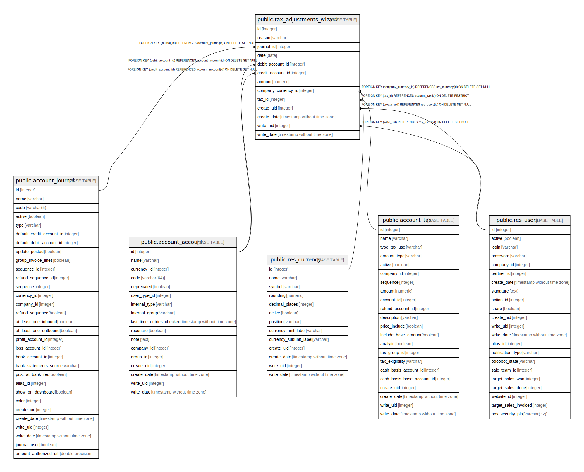

# public.tax_adjustments_wizard

## Description

Tax Adjustments Wizard

## Columns

| Name | Type | Default | Nullable | Children | Parents | Comment |
| ---- | ---- | ------- | -------- | -------- | ------- | ------- |
| id | integer | nextval('tax_adjustments_wizard_id_seq'::regclass) | false |  |  |  |
| reason | varchar |  | false |  |  | Justification |
| journal_id | integer |  | false |  | [public.account_journal](public.account_journal.md) | Journal |
| date | date |  | false |  |  | Date |
| debit_account_id | integer |  | false |  | [public.account_account](public.account_account.md) | Debit account |
| credit_account_id | integer |  | false |  | [public.account_account](public.account_account.md) | Credit account |
| amount | numeric |  | false |  |  | Amount |
| company_currency_id | integer |  | true |  | [public.res_currency](public.res_currency.md) | Company Currency |
| tax_id | integer |  | false |  | [public.account_tax](public.account_tax.md) | Adjustment Tax |
| create_uid | integer |  | true |  | [public.res_users](public.res_users.md) | Created by |
| create_date | timestamp without time zone |  | true |  |  | Created on |
| write_uid | integer |  | true |  | [public.res_users](public.res_users.md) | Last Updated by |
| write_date | timestamp without time zone |  | true |  |  | Last Updated on |

## Constraints

| Name | Type | Definition |
| ---- | ---- | ---------- |
| tax_adjustments_wizard_create_uid_fkey | FOREIGN KEY | FOREIGN KEY (create_uid) REFERENCES res_users(id) ON DELETE SET NULL |
| tax_adjustments_wizard_write_uid_fkey | FOREIGN KEY | FOREIGN KEY (write_uid) REFERENCES res_users(id) ON DELETE SET NULL |
| tax_adjustments_wizard_company_currency_id_fkey | FOREIGN KEY | FOREIGN KEY (company_currency_id) REFERENCES res_currency(id) ON DELETE SET NULL |
| tax_adjustments_wizard_credit_account_id_fkey | FOREIGN KEY | FOREIGN KEY (credit_account_id) REFERENCES account_account(id) ON DELETE SET NULL |
| tax_adjustments_wizard_debit_account_id_fkey | FOREIGN KEY | FOREIGN KEY (debit_account_id) REFERENCES account_account(id) ON DELETE SET NULL |
| tax_adjustments_wizard_journal_id_fkey | FOREIGN KEY | FOREIGN KEY (journal_id) REFERENCES account_journal(id) ON DELETE SET NULL |
| tax_adjustments_wizard_tax_id_fkey | FOREIGN KEY | FOREIGN KEY (tax_id) REFERENCES account_tax(id) ON DELETE RESTRICT |
| tax_adjustments_wizard_pkey | PRIMARY KEY | PRIMARY KEY (id) |

## Indexes

| Name | Definition |
| ---- | ---------- |
| tax_adjustments_wizard_pkey | CREATE UNIQUE INDEX tax_adjustments_wizard_pkey ON public.tax_adjustments_wizard USING btree (id) |

## Relations

---

> Generated by [tbls](https://github.com/k1LoW/tbls)
