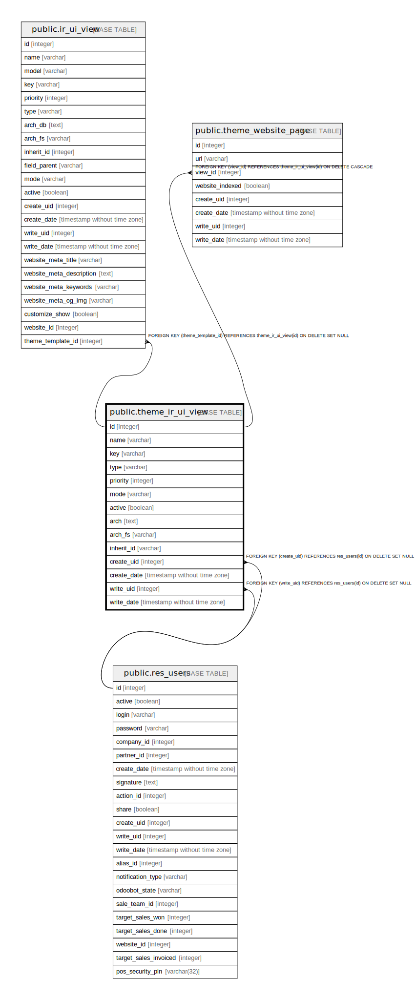

# public.theme_ir_ui_view

## Description

Theme UI View

## Columns

| Name | Type | Default | Nullable | Children | Parents | Comment |
| ---- | ---- | ------- | -------- | -------- | ------- | ------- |
| id | integer | nextval('theme_ir_ui_view_id_seq'::regclass) | false | [public.ir_ui_view](public.ir_ui_view.md) [public.theme_website_page](public.theme_website_page.md) |  |  |
| name | varchar |  | false |  |  | Name |
| key | varchar |  | true |  |  | Key |
| type | varchar |  | true |  |  | Type |
| priority | integer |  | false |  |  | Priority |
| mode | varchar |  | true |  |  | Mode |
| active | boolean |  | true |  |  | Active |
| arch | text |  | true |  |  | Arch |
| arch_fs | varchar |  | true |  |  | Arch Fs |
| inherit_id | varchar |  | true |  |  | Inherit |
| create_uid | integer |  | true |  | [public.res_users](public.res_users.md) | Created by |
| create_date | timestamp without time zone |  | true |  |  | Created on |
| write_uid | integer |  | true |  | [public.res_users](public.res_users.md) | Last Updated by |
| write_date | timestamp without time zone |  | true |  |  | Last Updated on |

## Constraints

| Name | Type | Definition |
| ---- | ---- | ---------- |
| theme_ir_ui_view_create_uid_fkey | FOREIGN KEY | FOREIGN KEY (create_uid) REFERENCES res_users(id) ON DELETE SET NULL |
| theme_ir_ui_view_write_uid_fkey | FOREIGN KEY | FOREIGN KEY (write_uid) REFERENCES res_users(id) ON DELETE SET NULL |
| theme_ir_ui_view_pkey | PRIMARY KEY | PRIMARY KEY (id) |

## Indexes

| Name | Definition |
| ---- | ---------- |
| theme_ir_ui_view_pkey | CREATE UNIQUE INDEX theme_ir_ui_view_pkey ON public.theme_ir_ui_view USING btree (id) |

## Relations

---

> Generated by [tbls](https://github.com/k1LoW/tbls)
