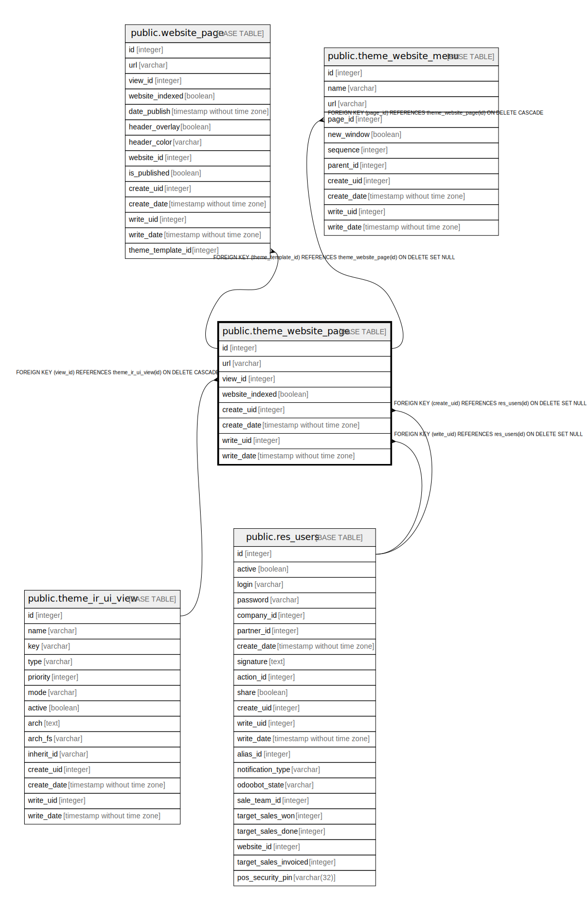

# public.theme_website_page

## Description

Website Theme Page

## Columns

| Name | Type | Default | Nullable | Children | Parents | Comment |
| ---- | ---- | ------- | -------- | -------- | ------- | ------- |
| id | integer | nextval('theme_website_page_id_seq'::regclass) | false | [public.website_page](public.website_page.md) [public.theme_website_menu](public.theme_website_menu.md) |  |  |
| url | varchar |  | true |  |  | Url |
| view_id | integer |  | false |  | [public.theme_ir_ui_view](public.theme_ir_ui_view.md) | View |
| website_indexed | boolean |  | true |  |  | Page Indexed |
| create_uid | integer |  | true |  | [public.res_users](public.res_users.md) | Created by |
| create_date | timestamp without time zone |  | true |  |  | Created on |
| write_uid | integer |  | true |  | [public.res_users](public.res_users.md) | Last Updated by |
| write_date | timestamp without time zone |  | true |  |  | Last Updated on |

## Constraints

| Name | Type | Definition |
| ---- | ---- | ---------- |
| theme_website_page_create_uid_fkey | FOREIGN KEY | FOREIGN KEY (create_uid) REFERENCES res_users(id) ON DELETE SET NULL |
| theme_website_page_write_uid_fkey | FOREIGN KEY | FOREIGN KEY (write_uid) REFERENCES res_users(id) ON DELETE SET NULL |
| theme_website_page_view_id_fkey | FOREIGN KEY | FOREIGN KEY (view_id) REFERENCES theme_ir_ui_view(id) ON DELETE CASCADE |
| theme_website_page_pkey | PRIMARY KEY | PRIMARY KEY (id) |

## Indexes

| Name | Definition |
| ---- | ---------- |
| theme_website_page_pkey | CREATE UNIQUE INDEX theme_website_page_pkey ON public.theme_website_page USING btree (id) |

## Relations

---

> Generated by [tbls](https://github.com/k1LoW/tbls)
