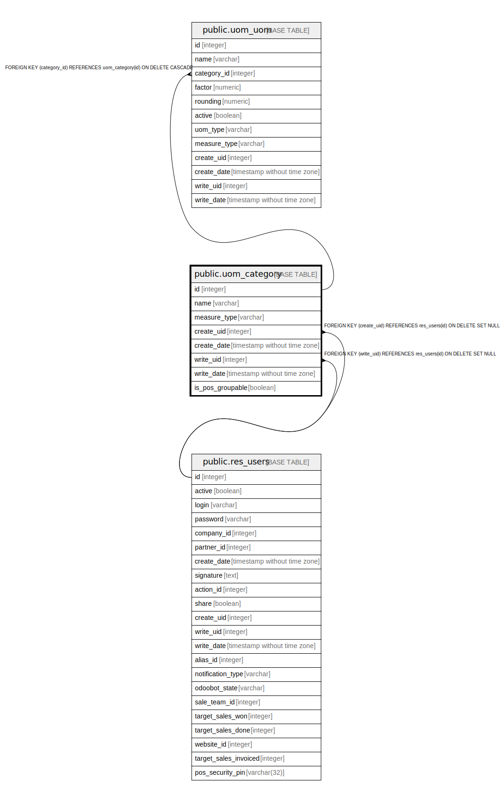

# public.uom_category

## Description

Product UoM Categories

## Columns

| Name | Type | Default | Nullable | Children | Parents | Comment |
| ---- | ---- | ------- | -------- | -------- | ------- | ------- |
| id | integer | nextval('uom_category_id_seq'::regclass) | false | [public.uom_uom](public.uom_uom.md) |  |  |
| name | varchar |  | false |  |  | Unit of Measure Category |
| measure_type | varchar |  | true |  |  | Type of Measure |
| create_uid | integer |  | true |  | [public.res_users](public.res_users.md) | Created by |
| create_date | timestamp without time zone |  | true |  |  | Created on |
| write_uid | integer |  | true |  | [public.res_users](public.res_users.md) | Last Updated by |
| write_date | timestamp without time zone |  | true |  |  | Last Updated on |
| is_pos_groupable | boolean |  | true |  |  | Group Products in POS |

## Constraints

| Name | Type | Definition | Comment |
| ---- | ---- | ---------- | ------- |
| uom_category_create_uid_fkey | FOREIGN KEY | FOREIGN KEY (create_uid) REFERENCES res_users(id) ON DELETE SET NULL |  |
| uom_category_write_uid_fkey | FOREIGN KEY | FOREIGN KEY (write_uid) REFERENCES res_users(id) ON DELETE SET NULL |  |
| uom_category_pkey | PRIMARY KEY | PRIMARY KEY (id) |  |
| uom_category_uom_category_unique_type | UNIQUE | UNIQUE (measure_type) | UNIQUE(measure_type) |

## Indexes

| Name | Definition |
| ---- | ---------- |
| uom_category_pkey | CREATE UNIQUE INDEX uom_category_pkey ON public.uom_category USING btree (id) |
| uom_category_uom_category_unique_type | CREATE UNIQUE INDEX uom_category_uom_category_unique_type ON public.uom_category USING btree (measure_type) |

## Relations

---

> Generated by [tbls](https://github.com/k1LoW/tbls)
