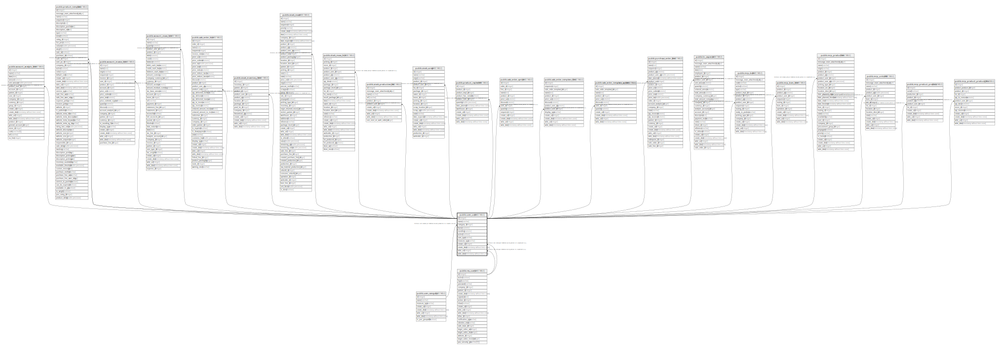

# public.uom_uom

## Description

Product Unit of Measure

## Columns

| Name | Type | Default | Nullable | Children | Parents | Comment |
| ---- | ---- | ------- | -------- | -------- | ------- | ------- |
| id | integer | nextval('uom_uom_id_seq'::regclass) | false | [public.account_analytic_line](public.account_analytic_line.md) [public.product_template](public.product_template.md) [public.account_invoice_line](public.account_invoice_line.md) [public.account_move_line](public.account_move_line.md) [public.sale_order_line](public.sale_order_line.md) [public.stock_inventory_line](public.stock_inventory_line.md) [public.stock_move](public.stock_move.md) [public.stock_move_line](public.stock_move_line.md) [public.stock_production_lot](public.stock_production_lot.md) [public.stock_scrap](public.stock_scrap.md) [public.product_replenish](public.product_replenish.md) [public.sale_order_option](public.sale_order_option.md) [public.sale_order_template_line](public.sale_order_template_line.md) [public.sale_order_template_option](public.sale_order_template_option.md) [public.purchase_order_line](public.purchase_order_line.md) [public.hr_expense](public.hr_expense.md) [public.mrp_bom](public.mrp_bom.md) [public.mrp_bom_line](public.mrp_bom_line.md) [public.mrp_production](public.mrp_production.md) [public.mrp_unbuild](public.mrp_unbuild.md) [public.mrp_product_produce](public.mrp_product_produce.md) [public.mrp_product_produce_line](public.mrp_product_produce_line.md) |  |  |
| name | varchar |  | false |  |  | Unit of Measure |
| category_id | integer |  | false |  | [public.uom_category](public.uom_category.md) | Category |
| factor | numeric |  | false |  |  | Ratio |
| rounding | numeric |  | false |  |  | Rounding Precision |
| active | boolean |  | true |  |  | Active |
| uom_type | varchar |  | false |  |  | Type |
| measure_type | varchar |  | true |  |  | Type of measurement category |
| create_uid | integer |  | true |  | [public.res_users](public.res_users.md) | Created by |
| create_date | timestamp without time zone |  | true |  |  | Created on |
| write_uid | integer |  | true |  | [public.res_users](public.res_users.md) | Last Updated by |
| write_date | timestamp without time zone |  | true |  |  | Last Updated on |

## Constraints

| Name | Type | Definition | Comment |
| ---- | ---- | ---------- | ------- |
| uom_uom_factor_gt_zero | CHECK | CHECK ((factor <> (0)::numeric)) | CHECK (factor!=0) |
| uom_uom_factor_reference_is_one | CHECK | CHECK (((((uom_type)::text = 'reference'::text) AND (factor = 1.0)) OR ((uom_type)::text <> 'reference'::text))) | CHECK((uom_type = 'reference' AND factor = 1.0) OR (uom_type != 'reference')) |
| uom_uom_rounding_gt_zero | CHECK | CHECK ((rounding > (0)::numeric)) | CHECK (rounding>0) |
| uom_uom_create_uid_fkey | FOREIGN KEY | FOREIGN KEY (create_uid) REFERENCES res_users(id) ON DELETE SET NULL |  |
| uom_uom_write_uid_fkey | FOREIGN KEY | FOREIGN KEY (write_uid) REFERENCES res_users(id) ON DELETE SET NULL |  |
| uom_uom_category_id_fkey | FOREIGN KEY | FOREIGN KEY (category_id) REFERENCES uom_category(id) ON DELETE CASCADE |  |
| uom_uom_pkey | PRIMARY KEY | PRIMARY KEY (id) |  |

## Indexes

| Name | Definition |
| ---- | ---------- |
| uom_uom_pkey | CREATE UNIQUE INDEX uom_uom_pkey ON public.uom_uom USING btree (id) |

## Relations

---

> Generated by [tbls](https://github.com/k1LoW/tbls)
