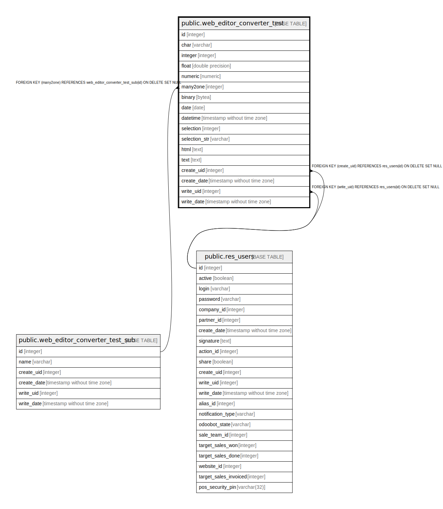

# public.web_editor_converter_test

## Description

Web Editor Converter Test

## Columns

| Name | Type | Default | Nullable | Children | Parents | Comment |
| ---- | ---- | ------- | -------- | -------- | ------- | ------- |
| id | integer | nextval('web_editor_converter_test_id_seq'::regclass) | false |  |  |  |
| char | varchar |  | true |  |  | Char |
| integer | integer |  | true |  |  | Integer |
| float | double precision |  | true |  |  | Float |
| numeric | numeric |  | true |  |  | Numeric |
| many2one | integer |  | true |  | [public.web_editor_converter_test_sub](public.web_editor_converter_test_sub.md) | Many2One |
| binary | bytea |  | true |  |  | Binary |
| date | date |  | true |  |  | Date |
| datetime | timestamp without time zone |  | true |  |  | Datetime |
| selection | integer |  | true |  |  | Selection |
| selection_str | varchar |  | true |  |  | Lorsqu'un pancake prend l'avion à destination de Toronto et qu'il fait une escale technique à St Claude, on dit: |
| html | text |  | true |  |  | Html |
| text | text |  | true |  |  | Text |
| create_uid | integer |  | true |  | [public.res_users](public.res_users.md) | Created by |
| create_date | timestamp without time zone |  | true |  |  | Created on |
| write_uid | integer |  | true |  | [public.res_users](public.res_users.md) | Last Updated by |
| write_date | timestamp without time zone |  | true |  |  | Last Updated on |

## Constraints

| Name | Type | Definition |
| ---- | ---- | ---------- |
| web_editor_converter_test_create_uid_fkey | FOREIGN KEY | FOREIGN KEY (create_uid) REFERENCES res_users(id) ON DELETE SET NULL |
| web_editor_converter_test_write_uid_fkey | FOREIGN KEY | FOREIGN KEY (write_uid) REFERENCES res_users(id) ON DELETE SET NULL |
| web_editor_converter_test_pkey | PRIMARY KEY | PRIMARY KEY (id) |
| web_editor_converter_test_many2one_fkey | FOREIGN KEY | FOREIGN KEY (many2one) REFERENCES web_editor_converter_test_sub(id) ON DELETE SET NULL |

## Indexes

| Name | Definition |
| ---- | ---------- |
| web_editor_converter_test_pkey | CREATE UNIQUE INDEX web_editor_converter_test_pkey ON public.web_editor_converter_test USING btree (id) |

## Relations

---

> Generated by [tbls](https://github.com/k1LoW/tbls)
