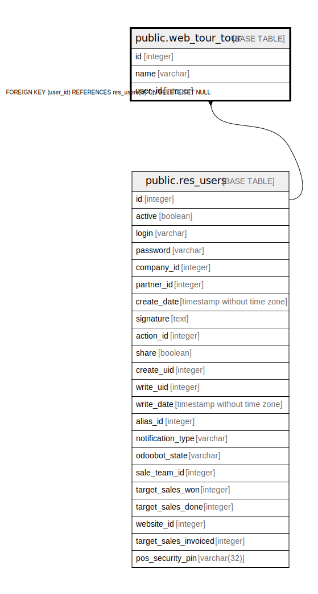

# public.web_tour_tour

## Description

Tours

## Columns

| Name | Type | Default | Nullable | Children | Parents | Comment |
| ---- | ---- | ------- | -------- | -------- | ------- | ------- |
| id | integer | nextval('web_tour_tour_id_seq'::regclass) | false |  |  |  |
| name | varchar |  | false |  |  | Tour name |
| user_id | integer |  | true |  | [public.res_users](public.res_users.md) | Consumed by |

## Constraints

| Name | Type | Definition |
| ---- | ---- | ---------- |
| web_tour_tour_user_id_fkey | FOREIGN KEY | FOREIGN KEY (user_id) REFERENCES res_users(id) ON DELETE SET NULL |
| web_tour_tour_pkey | PRIMARY KEY | PRIMARY KEY (id) |

## Indexes

| Name | Definition |
| ---- | ---------- |
| web_tour_tour_pkey | CREATE UNIQUE INDEX web_tour_tour_pkey ON public.web_tour_tour USING btree (id) |

## Relations

---

> Generated by [tbls](https://github.com/k1LoW/tbls)
