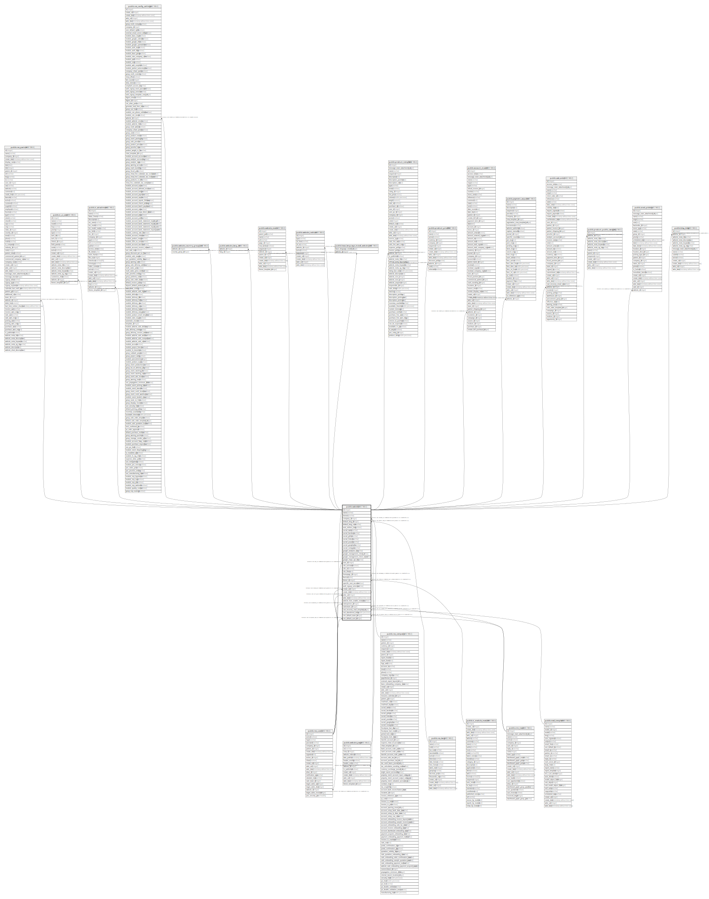

# public.website

## Description

Website

## Columns

| Name | Type | Default | Nullable | Children | Parents | Comment |
| ---- | ---- | ------- | -------- | -------- | ------- | ------- |
| id | integer | nextval('website_id_seq'::regclass) | false | [public.res_users](public.res_users.md) [public.res_partner](public.res_partner.md) [public.ir_ui_view](public.ir_ui_view.md) [public.ir_attachment](public.ir_attachment.md) [public.res_config_settings](public.res_config_settings.md) [public.website_country_group_rel](public.website_country_group_rel.md) [public.website_lang_rel](public.website_lang_rel.md) [public.website_page](public.website_page.md) [public.website_menu](public.website_menu.md) [public.website_redirect](public.website_redirect.md) [public.base_language_install_website_rel](public.base_language_install_website_rel.md) [public.product_template](public.product_template.md) [public.product_pricelist](public.product_pricelist.md) [public.account_invoice](public.account_invoice.md) [public.payment_acquirer](public.payment_acquirer.md) [public.sale_order](public.sale_order.md) [public.product_public_category](public.product_public_category.md) [public.stock_picking](public.stock_picking.md) [public.blog_blog](public.blog_blog.md) |  |  |
| name | varchar |  | false |  |  | Website Name |
| domain | varchar |  | true |  |  | Website Domain |
| company_id | integer |  | false |  | [public.res_company](public.res_company.md) | Company |
| default_lang_id | integer |  | false |  | [public.res_lang](public.res_lang.md) | Default Language |
| default_lang_code | varchar |  | true |  |  | Default language code |
| auto_redirect_lang | boolean |  | true |  |  | Autoredirect Language |
| social_twitter | varchar |  | true |  |  | Twitter Account |
| social_facebook | varchar |  | true |  |  | Facebook Account |
| social_github | varchar |  | true |  |  | GitHub Account |
| social_linkedin | varchar |  | true |  |  | LinkedIn Account |
| social_youtube | varchar |  | true |  |  | Youtube Account |
| social_googleplus | varchar |  | true |  |  | Google+ Account |
| social_instagram | varchar |  | true |  |  | Instagram Account |
| google_analytics_key | varchar |  | true |  |  | Google Analytics Key |
| google_management_client_id | varchar |  | true |  |  | Google Client ID |
| google_management_client_secret | varchar |  | true |  |  | Google Client Secret |
| google_maps_api_key | varchar |  | true |  |  | Google Maps API Key |
| user_id | integer |  | false |  | [public.res_users](public.res_users.md) | Public User |
| cdn_activated | boolean |  | true |  |  | Content Delivery Network (CDN) |
| cdn_url | varchar |  | true |  |  | CDN Base URL |
| cdn_filters | text |  | true |  |  | CDN Filters |
| homepage_id | integer |  | true |  | [public.website_page](public.website_page.md) | Homepage |
| favicon | bytea |  | true |  |  | Website Favicon |
| theme_id | integer |  | true |  | [public.ir_module_module](public.ir_module_module.md) | Theme |
| specific_user_account | boolean |  | true |  |  | Specific User Account |
| auth_signup_uninvited | varchar |  | true |  |  | Customer Account |
| create_uid | integer |  | true |  | [public.res_users](public.res_users.md) | Created by |
| create_date | timestamp without time zone |  | true |  |  | Created on |
| write_uid | integer |  | true |  | [public.res_users](public.res_users.md) | Last Updated by |
| write_date | timestamp without time zone |  | true |  |  | Last Updated on |
| website_form_enable_metadata | boolean |  | true |  |  | Technical data on contact form |
| salesperson_id | integer |  | true |  | [public.res_users](public.res_users.md) | Salesperson |
| salesteam_id | integer |  | true |  | [public.crm_team](public.crm_team.md) | Sales Team |
| cart_recovery_mail_template_id | integer |  | true |  | [public.mail_template](public.mail_template.md) | Cart Recovery Email |
| cart_abandoned_delay | double precision |  | true |  |  | Abandoned Delay |
| crm_default_team_id | integer |  | true |  | [public.crm_team](public.crm_team.md) | Default Sales Teams |
| crm_default_user_id | integer |  | true |  | [public.res_users](public.res_users.md) | Default Salesperson |

## Constraints

| Name | Type | Definition |
| ---- | ---- | ---------- |
| website_create_uid_fkey | FOREIGN KEY | FOREIGN KEY (create_uid) REFERENCES res_users(id) ON DELETE SET NULL |
| website_crm_default_user_id_fkey | FOREIGN KEY | FOREIGN KEY (crm_default_user_id) REFERENCES res_users(id) ON DELETE SET NULL |
| website_salesperson_id_fkey | FOREIGN KEY | FOREIGN KEY (salesperson_id) REFERENCES res_users(id) ON DELETE SET NULL |
| website_user_id_fkey | FOREIGN KEY | FOREIGN KEY (user_id) REFERENCES res_users(id) ON DELETE SET NULL |
| website_write_uid_fkey | FOREIGN KEY | FOREIGN KEY (write_uid) REFERENCES res_users(id) ON DELETE SET NULL |
| website_theme_id_fkey | FOREIGN KEY | FOREIGN KEY (theme_id) REFERENCES ir_module_module(id) ON DELETE SET NULL |
| website_company_id_fkey | FOREIGN KEY | FOREIGN KEY (company_id) REFERENCES res_company(id) ON DELETE SET NULL |
| website_default_lang_id_fkey | FOREIGN KEY | FOREIGN KEY (default_lang_id) REFERENCES res_lang(id) ON DELETE SET NULL |
| website_cart_recovery_mail_template_id_fkey | FOREIGN KEY | FOREIGN KEY (cart_recovery_mail_template_id) REFERENCES mail_template(id) ON DELETE SET NULL |
| website_crm_default_team_id_fkey | FOREIGN KEY | FOREIGN KEY (crm_default_team_id) REFERENCES crm_team(id) ON DELETE SET NULL |
| website_salesteam_id_fkey | FOREIGN KEY | FOREIGN KEY (salesteam_id) REFERENCES crm_team(id) ON DELETE SET NULL |
| website_pkey | PRIMARY KEY | PRIMARY KEY (id) |
| website_homepage_id_fkey | FOREIGN KEY | FOREIGN KEY (homepage_id) REFERENCES website_page(id) ON DELETE SET NULL |

## Indexes

| Name | Definition |
| ---- | ---------- |
| website_pkey | CREATE UNIQUE INDEX website_pkey ON public.website USING btree (id) |

## Relations

---

> Generated by [tbls](https://github.com/k1LoW/tbls)
