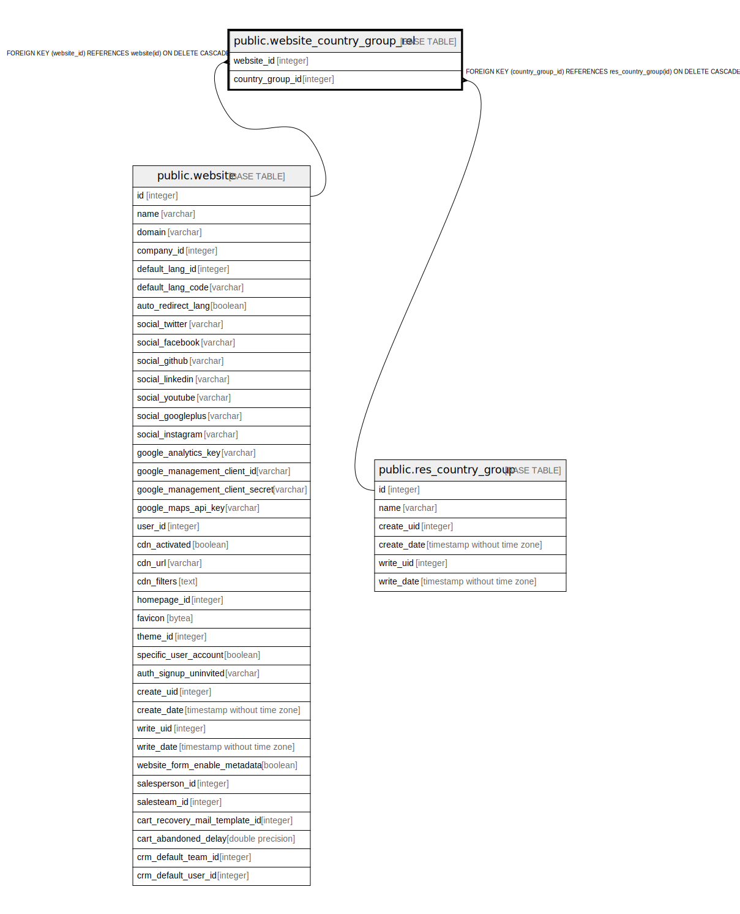

# public.website_country_group_rel

## Description

RELATION BETWEEN website AND res_country_group

## Columns

| Name | Type | Default | Nullable | Children | Parents | Comment |
| ---- | ---- | ------- | -------- | -------- | ------- | ------- |
| website_id | integer |  | false |  | [public.website](public.website.md) |  |
| country_group_id | integer |  | false |  | [public.res_country_group](public.res_country_group.md) |  |

## Constraints

| Name | Type | Definition |
| ---- | ---- | ---------- |
| website_country_group_rel_country_group_id_fkey | FOREIGN KEY | FOREIGN KEY (country_group_id) REFERENCES res_country_group(id) ON DELETE CASCADE |
| website_country_group_rel_website_id_fkey | FOREIGN KEY | FOREIGN KEY (website_id) REFERENCES website(id) ON DELETE CASCADE |
| website_country_group_rel_website_id_country_group_id_key | UNIQUE | UNIQUE (website_id, country_group_id) |

## Indexes

| Name | Definition |
| ---- | ---------- |
| website_country_group_rel_website_id_country_group_id_key | CREATE UNIQUE INDEX website_country_group_rel_website_id_country_group_id_key ON public.website_country_group_rel USING btree (website_id, country_group_id) |
| website_country_group_rel_website_id_idx | CREATE INDEX website_country_group_rel_website_id_idx ON public.website_country_group_rel USING btree (website_id) |
| website_country_group_rel_country_group_id_idx | CREATE INDEX website_country_group_rel_country_group_id_idx ON public.website_country_group_rel USING btree (country_group_id) |

## Relations

---

> Generated by [tbls](https://github.com/k1LoW/tbls)
