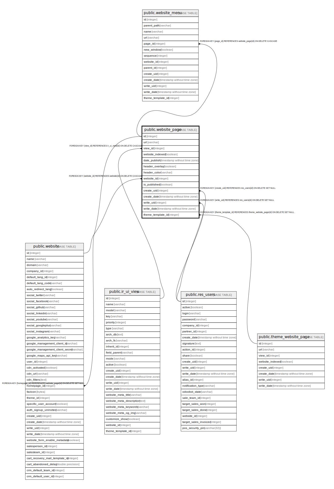

# public.website_page

## Description

Page

## Columns

| Name | Type | Default | Nullable | Children | Parents | Comment |
| ---- | ---- | ------- | -------- | -------- | ------- | ------- |
| id | integer | nextval('website_page_id_seq'::regclass) | false | [public.website](public.website.md) [public.website_menu](public.website_menu.md) |  |  |
| url | varchar |  | true |  |  | Page URL |
| view_id | integer |  | false |  | [public.ir_ui_view](public.ir_ui_view.md) | View |
| website_indexed | boolean |  | true |  |  | Page Indexed |
| date_publish | timestamp without time zone |  | true |  |  | Publishing Date |
| header_overlay | boolean |  | true |  |  | Header Overlay |
| header_color | varchar |  | true |  |  | Header Color |
| website_id | integer |  | true |  | [public.website](public.website.md) | Website |
| is_published | boolean |  | true |  |  | Is published |
| create_uid | integer |  | true |  | [public.res_users](public.res_users.md) | Created by |
| create_date | timestamp without time zone |  | true |  |  | Created on |
| write_uid | integer |  | true |  | [public.res_users](public.res_users.md) | Last Updated by |
| write_date | timestamp without time zone |  | true |  |  | Last Updated on |
| theme_template_id | integer |  | true |  | [public.theme_website_page](public.theme_website_page.md) | Theme Template |

## Constraints

| Name | Type | Definition |
| ---- | ---- | ---------- |
| website_page_create_uid_fkey | FOREIGN KEY | FOREIGN KEY (create_uid) REFERENCES res_users(id) ON DELETE SET NULL |
| website_page_write_uid_fkey | FOREIGN KEY | FOREIGN KEY (write_uid) REFERENCES res_users(id) ON DELETE SET NULL |
| website_page_view_id_fkey | FOREIGN KEY | FOREIGN KEY (view_id) REFERENCES ir_ui_view(id) ON DELETE CASCADE |
| website_page_website_id_fkey | FOREIGN KEY | FOREIGN KEY (website_id) REFERENCES website(id) ON DELETE CASCADE |
| website_page_pkey | PRIMARY KEY | PRIMARY KEY (id) |
| website_page_theme_template_id_fkey | FOREIGN KEY | FOREIGN KEY (theme_template_id) REFERENCES theme_website_page(id) ON DELETE SET NULL |

## Indexes

| Name | Definition |
| ---- | ---------- |
| website_page_pkey | CREATE UNIQUE INDEX website_page_pkey ON public.website_page USING btree (id) |

## Relations

---

> Generated by [tbls](https://github.com/k1LoW/tbls)
