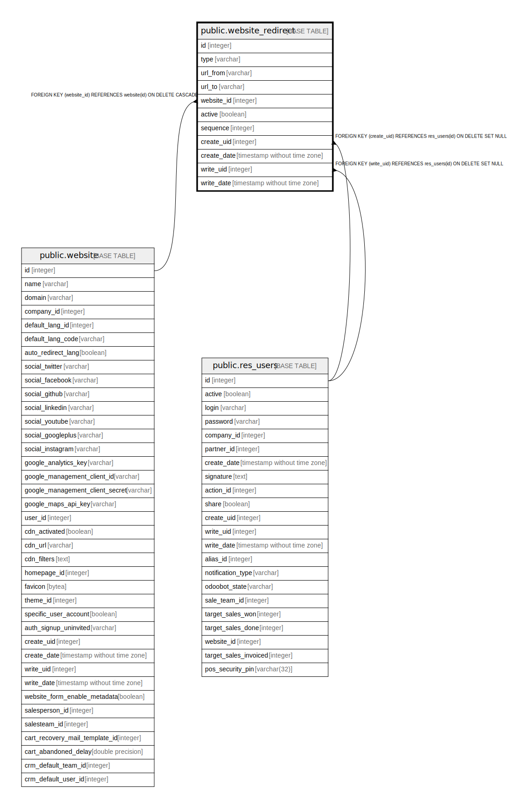

# public.website_redirect

## Description

Website Redirect

## Columns

| Name | Type | Default | Nullable | Children | Parents | Comment |
| ---- | ---- | ------- | -------- | -------- | ------- | ------- |
| id | integer | nextval('website_redirect_id_seq'::regclass) | false |  |  |  |
| type | varchar |  | false |  |  | Redirection Type |
| url_from | varchar |  | false |  |  | Redirect From |
| url_to | varchar |  | false |  |  | Redirect To |
| website_id | integer |  | true |  | [public.website](public.website.md) | Website |
| active | boolean |  | true |  |  | Active |
| sequence | integer |  | true |  |  | Sequence |
| create_uid | integer |  | true |  | [public.res_users](public.res_users.md) | Created by |
| create_date | timestamp without time zone |  | true |  |  | Created on |
| write_uid | integer |  | true |  | [public.res_users](public.res_users.md) | Last Updated by |
| write_date | timestamp without time zone |  | true |  |  | Last Updated on |

## Constraints

| Name | Type | Definition |
| ---- | ---- | ---------- |
| website_redirect_create_uid_fkey | FOREIGN KEY | FOREIGN KEY (create_uid) REFERENCES res_users(id) ON DELETE SET NULL |
| website_redirect_write_uid_fkey | FOREIGN KEY | FOREIGN KEY (write_uid) REFERENCES res_users(id) ON DELETE SET NULL |
| website_redirect_website_id_fkey | FOREIGN KEY | FOREIGN KEY (website_id) REFERENCES website(id) ON DELETE CASCADE |
| website_redirect_pkey | PRIMARY KEY | PRIMARY KEY (id) |

## Indexes

| Name | Definition |
| ---- | ---------- |
| website_redirect_pkey | CREATE UNIQUE INDEX website_redirect_pkey ON public.website_redirect USING btree (id) |

## Relations

---

> Generated by [tbls](https://github.com/k1LoW/tbls)
